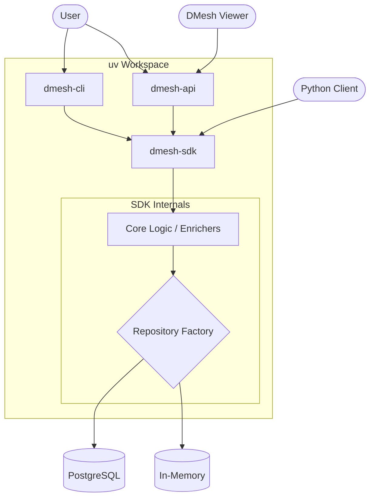
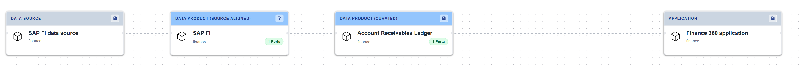
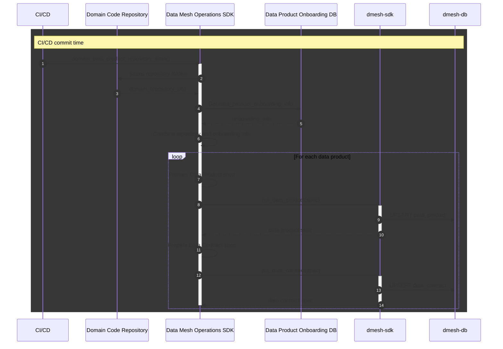
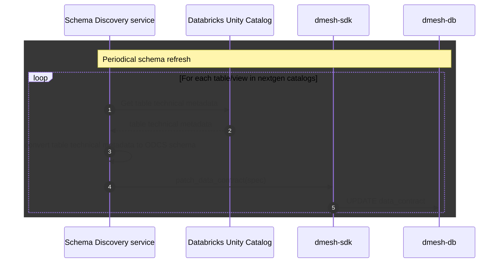
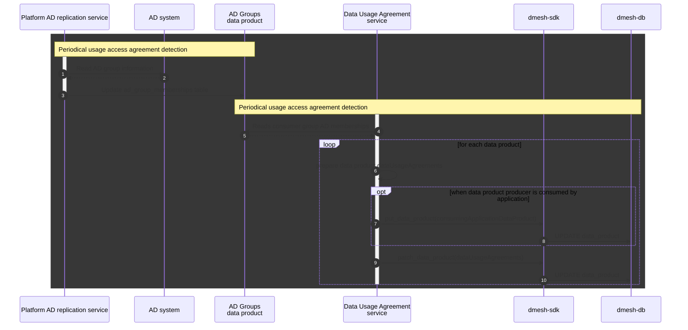

# Overview
DMesh provides a set of tools to help organisations manage a data mesh, using standard data mesh open standards specifications.
At a high level DMesh provides: 
- Ability to create and manage data products and data contracts with easy to use interfaces (SDK, API, CLI)
- Exposes `/discover` data mesh endpoint that is compatible with [DMesh Viewer](https://github.com/dmesh-zone/dmesh-viewer). 

# Goal
The goal of this document is to describe how to integrate DMesh with an organisation's existing stack.

# Architecture building blocks

DMesh is structured as a modular Python workspace with a clear separation of concerns:

-   **`dmesh-sdk`**: The core logic layer, built upon Python. Provides put, patch, get and delete operations for Open Data Product and Open Data Contract specifications through a repository factory pattern that supports in-memory (for testing) and PostgreSQL (for production-like) persistency. It is available in PyPI as [dmesh-sdk](https://pypi.org/project/dmesh-sdk) package.
-   **`dmesh-cli`**: A Typer-powered command-line interface for local-first development. It allows users to setup a local environment, and manage data product and data contract specifications stored in a PostgreSQL backend.
-   **`dmesh-api`**: A FastAPI backend. It provides a RESTful interface to allow visual discovery of Data Mesh using [DMesh viewer](https://github.com/dm3-org/dmesh-viewer), and allows external integrations. It uses `psycopg3` for robust, async PostgreSQL persistence.



# Quick start guide

Easiest way to start is to use the CLI in interactive mode
> Docker needs to be running to setup the local environment

## Step 0: Clone dmesh-core repository and install dependencies

```shell
# Install uv package manager, which dmesh requires
pip install uv
git clone https://github.com/dmesh-zone/dmesh-core.git
cd dmesh-core
```

## Step 1: Start CLI in interactive mode
```shell
uv run dmesh -i
```

## Step 2: Run required docker containers using the `setup` command
```shell
dmesh> setup
Initializing local data mesh environment...
Starting infrastructure via docker-compose...
...
Data mesh initialised and ready (Postgres mode).
```

## Step 3: Create test data using the `testdata` command

```shell
dmesh> testdata
Creating Data Product: finance.sap_fi (sourceAligned)
  Creating Data Contract for schema: accounting_document_line_items
Creating Data Product: finance.account_receivables_ledger (curated)
  Creating Data Contract for schema: customer_open_items
Creating Data Product: finance.360_finance (consumerAligned)
  Creating Data Contract for schema: financial_overview_report
Creating Data Product: finance.360_finance_application (application)
Creating edge: sap_fi -> account_receivables_ledger
Creating edge: account_receivables_ledger -> 360_finance
Creating edge: 360_finance -> 360_finance_application
Test data generation complete.
```

## Step 4: List the created data products

```shell
dmesh> list dps
ID                                    DOMAIN                NAME                            VERSION       STATUS
----------------------------------------------------------------------------------------------------------------------
50ac0fd8-0c42-5bb4-94be-09cb3324e951  finance               360_finance                     v1.0.0        ACTIVE
05167ad3-b99a-52f3-8806-faa1bef615da  finance               360_finance_application         v1.0.0        ACTIVE
172f12b3-bc54-5d75-95e7-a241182f8cda  finance               account_receivables_ledger      v1.0.0        ACTIVE
0a9a3c38-38ac-585c-9712-55649082db66  finance               sap_fi                          v1.0.0        ACTIVE
86970a19-3490-5cdd-bfe9-de71394a85f1  finance               sap_fi data source              v1.0.0        ACTIVE
```

## Step 5: Clone the DMesh Viewer repository to your local machine

In another terminal window:

```shell
git clone https://github.com/dmesh-zone/dmesh-viewer.git
```

## Step 6: Update DMesh Viewer to point to the DMesh API (`http://localhost:8000/dmesh/discover`)

```shell
cd dmesh-viewer
# Clone config.yaml into customConfig.yaml 
cp ./public/config.yaml ./public/customConfig.yaml
```

# Update the first line of customConfig.yaml to point to DMesh API endpoint
```yaml
defaultDataMeshOperationalDataUrl: http://localhost:8000/dmesh/discover`
```

## Step 7: Start DMesh Viewer

Start DMesh Viewer by running the `npm start` command in the `dmesh-viewer` directory:

```shell
npm install
npm run dev
```
When you see `➜ Local:   http://localhost:5173/dmesh-viewer/` you can open the browser and navigate to that URL.

## Step 8: Verify the Data Mesh data products and data contracts are visible in DMesh Viewer

You should then see the data mesh data products and data contracts visible in DMesh Viewer, as shown below:


## Step 9: Clean up the test data

Type the `clean` command in dmesh CLI window to remove all the test data:

```shell
dmesh> clean
Data mesh cleaned (all tables truncated).
```

## Step 10: Verify the Data Mesh data products and data contracts are no longer visible in DMesh Viewer

```shell
dmesh> list dps
No data products found.
```

If you refresh your DMesh Viewer in your browser you should see that the data products and data contracts are no longer visible. You should be presented with a blank screen.

## Step 11: Run the SDK integration test to demonstrate execute the reference integration flows described in the following section

In dmesh-core working directory:

```shell
uv run pytest ./tests/integration/sdk/test_sdk_client_lifecycle.py --external-db
```

dmesh viewer should now show the data products and data contracts created by the test, as shown below:



# Reference integration strategy

It is assumed that the organisation integrating with DMesh:
1. Has embraced the data mesh architecture.
2. Has a data product onboarding process and associated database
3. Uses CI/CD to develop data products
4. Wants to manage data contracts, including technical metadata, like . table/view columns and associated types, or other types such as api, topic, file, etc

The integration strategy is composed of three independent flows:

* CI/CD flow
* Schema refresh flow
* Usage Agreement flow

The following sections show the three flows in detail, and sample code is provided in `tests\integration\sdk\test_sdk_client_lifecycle.py` so you can use it as a starting point for your own integration.

Notice that the integration strategy is split in 3 flows and the flows can independently update the same data products and data contracts, by leveraging the patching capabilities of the SDK.
This is demonstrated in the integration test reference above.

## CI/CD flow

The assumption in this flow is a that the organisation integrating with DMesh already has a data product onboarding flow which
1. Stores data product onboarding information in a database (the Data Product Onboarding DB, depicted below).
2. Creates data product pipeline code in a Git repository (the Domain Code Repository, depicted below)



## Schema refresh flow

The Schema Refresh flow is triggered by an external service which periodically scans data dictionary (e.g. Databricks Unity Catalog) and updates the data contracts in DMesh.
Notice the data_contracts are updated via patch_data_contract to avoid overwriting other data contract attributes like managed by other flows



## Usage Agreement flow

This flow works on the principle that access to data products is managed via AD groups. A central Data Usage Agreement service periodically reads AD group memberships and updates data product dataUsageAgreements accordingly, so the same can be discovered at runtime, and access from downstream data products and applications to upstream data products can be visualised using DMesh Viewer.

