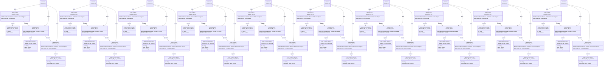

```mermaid
classDiagram
    %% DOMAINS
    class domain_01{
        <<domain>>
    }
    class domain_02{
        <<domain>>
    }
    class domain_03{
        <<domain>>
    }
    class domain_04{
        <<domain>>
    }
    class domain_05{
        <<domain>>
    }
    class domain_06{
        <<domain>>
    }
    class domain_07{
        <<domain>>
    }
    class domain_08{
        <<domain>>
    }
    class domain_09{
        <<domain>>
    }
    class domain_10{
        <<domain>>
    }
    %% OWNERSHIP
    domain_01 --> domain_01_src : owns
    domain_01 --> domain_01_cur : owns
    domain_01 --> domain_01_con : owns
    domain_02 --> domain_02_src : owns
    domain_02 --> domain_02_cur : owns
    domain_02 --> domain_02_con : owns
    domain_03 --> domain_03_src : owns
    domain_03 --> domain_03_cur : owns
    domain_03 --> domain_03_con : owns
    domain_04 --> domain_04_src : owns
    domain_04 --> domain_04_cur : owns
    domain_04 --> domain_04_con : owns
    domain_05 --> domain_05_src : owns
    domain_05 --> domain_05_cur : owns
    domain_05 --> domain_05_con : owns
    domain_06 --> domain_06_src : owns
    domain_06 --> domain_06_cur : owns
    domain_06 --> domain_06_con : owns
    domain_07 --> domain_07_src : owns
    domain_07 --> domain_07_cur : owns
    domain_07 --> domain_07_con : owns
    domain_08 --> domain_08_src : owns
    domain_08 --> domain_08_cur : owns
    domain_08 --> domain_08_con : owns
    domain_09 --> domain_09_src : owns
    domain_09 --> domain_09_cur : owns
    domain_09 --> domain_09_con : owns
    domain_10 --> domain_10_src : owns
    domain_10 --> domain_10_cur : owns
    domain_10 --> domain_10_con : owns
    %% SOURCE ALIGNED DATA PRODUCTS
    domain_01_src --> domain_01_src_schema : exposes
    class domain_01_src{
        <<data-product>>
        dataProductBusinessName : Domain 01 Source Aligned
        dataProductTier : sourceAligned
    }
    class domain_01_src_schema{
        <<data-contract-schema>>
        id : string
        value : number
    }
    domain_02_src --> domain_02_src_schema : exposes
    class domain_02_src{
        <<data-product>>
        dataProductBusinessName : Domain 02 Source Aligned
        dataProductTier : sourceAligned
    }
    class domain_02_src_schema{
        <<data-contract-schema>>
        id : string
        value : number
    }
    domain_03_src --> domain_03_src_schema : exposes
    class domain_03_src{
        <<data-product>>
        dataProductBusinessName : Domain 03 Source Aligned
        dataProductTier : sourceAligned
    }
    class domain_03_src_schema{
        <<data-contract-schema>>
        id : string
        value : number
    }
    domain_04_src --> domain_04_src_schema : exposes
    class domain_04_src{
        <<data-product>>
        dataProductBusinessName : Domain 04 Source Aligned
        dataProductTier : sourceAligned
    }
    class domain_04_src_schema{
        <<data-contract-schema>>
        id : string
        value : number
    }
    domain_05_src --> domain_05_src_schema : exposes
    class domain_05_src{
        <<data-product>>
        dataProductBusinessName : Domain 05 Source Aligned
        dataProductTier : sourceAligned
    }
    class domain_05_src_schema{
        <<data-contract-schema>>
        id : string
        value : number
    }
    domain_06_src --> domain_06_src_schema : exposes
    class domain_06_src{
        <<data-product>>
        dataProductBusinessName : Domain 06 Source Aligned
        dataProductTier : sourceAligned
    }
    class domain_06_src_schema{
        <<data-contract-schema>>
        id : string
        value : number
    }
    domain_07_src --> domain_07_src_schema : exposes
    class domain_07_src{
        <<data-product>>
        dataProductBusinessName : Domain 07 Source Aligned
        dataProductTier : sourceAligned
    }
    class domain_07_src_schema{
        <<data-contract-schema>>
        id : string
        value : number
    }
    domain_08_src --> domain_08_src_schema : exposes
    class domain_08_src{
        <<data-product>>
        dataProductBusinessName : Domain 08 Source Aligned
        dataProductTier : sourceAligned
    }
    class domain_08_src_schema{
        <<data-contract-schema>>
        id : string
        value : number
    }
    domain_09_src --> domain_09_src_schema : exposes
    class domain_09_src{
        <<data-product>>
        dataProductBusinessName : Domain 09 Source Aligned
        dataProductTier : sourceAligned
    }
    class domain_09_src_schema{
        <<data-contract-schema>>
        id : string
        value : number
    }
    domain_10_src --> domain_10_src_schema : exposes
    class domain_10_src{
        <<data-product>>
        dataProductBusinessName : Domain 10 Source Aligned
        dataProductTier : sourceAligned
    }
    class domain_10_src_schema{
        <<data-contract-schema>>
        id : string
        value : number
    }
    %% CURATED DATA PRODUCTS
    domain_01_cur --> domain_01_cur_schema : exposes
    class domain_01_cur{
        <<data-product>>
        dataProductBusinessName : Domain 01 Curated
        dataProductTier : curated
    }
    class domain_01_cur_schema{
        <<data-contract-schema>>
        id : string
        value : number
        status : string
    }
    domain_02_cur --> domain_02_cur_schema : exposes
    class domain_02_cur{
        <<data-product>>
        dataProductBusinessName : Domain 02 Curated
        dataProductTier : curated
    }
    class domain_02_cur_schema{
        <<data-contract-schema>>
        id : string
        value : number
        status : string
    }
    domain_03_cur --> domain_03_cur_schema : exposes
    class domain_03_cur{
        <<data-product>>
        dataProductBusinessName : Domain 03 Curated
        dataProductTier : curated
    }
    class domain_03_cur_schema{
        <<data-contract-schema>>
        id : string
        value : number
        status : string
    }
    domain_04_cur --> domain_04_cur_schema : exposes
    class domain_04_cur{
        <<data-product>>
        dataProductBusinessName : Domain 04 Curated
        dataProductTier : curated
    }
    class domain_04_cur_schema{
        <<data-contract-schema>>
        id : string
        value : number
        status : string
    }
    domain_05_cur --> domain_05_cur_schema : exposes
    class domain_05_cur{
        <<data-product>>
        dataProductBusinessName : Domain 05 Curated
        dataProductTier : curated
    }
    class domain_05_cur_schema{
        <<data-contract-schema>>
        id : string
        value : number
        status : string
    }
    domain_06_cur --> domain_06_cur_schema : exposes
    class domain_06_cur{
        <<data-product>>
        dataProductBusinessName : Domain 06 Curated
        dataProductTier : curated
    }
    class domain_06_cur_schema{
        <<data-contract-schema>>
        id : string
        value : number
        status : string
    }
    domain_07_cur --> domain_07_cur_schema : exposes
    class domain_07_cur{
        <<data-product>>
        dataProductBusinessName : Domain 07 Curated
        dataProductTier : curated
    }
    class domain_07_cur_schema{
        <<data-contract-schema>>
        id : string
        value : number
        status : string
    }
    domain_08_cur --> domain_08_cur_schema : exposes
    class domain_08_cur{
        <<data-product>>
        dataProductBusinessName : Domain 08 Curated
        dataProductTier : curated
    }
    class domain_08_cur_schema{
        <<data-contract-schema>>
        id : string
        value : number
        status : string
    }
    domain_09_cur --> domain_09_cur_schema : exposes
    class domain_09_cur{
        <<data-product>>
        dataProductBusinessName : Domain 09 Curated
        dataProductTier : curated
    }
    class domain_09_cur_schema{
        <<data-contract-schema>>
        id : string
        value : number
        status : string
    }
    domain_10_cur --> domain_10_cur_schema : exposes
    class domain_10_cur{
        <<data-product>>
        dataProductBusinessName : Domain 10 Curated
        dataProductTier : curated
    }
    class domain_10_cur_schema{
        <<data-contract-schema>>
        id : string
        value : number
        status : string
    }
    %% CONSUMER ALIGNED DATA PRODUCTS
    domain_01_con --> domain_01_con_schema : exposes
    class domain_01_con{
        <<data-product>>
        dataProductBusinessName : Domain 01 Consumer Aligned
        dataProductTier : consumerAligned
    }
    class domain_01_con_schema{
        <<data-contract-schema>>
        id : string
        aggregated_value : number
    }
    domain_02_con --> domain_02_con_schema : exposes
    class domain_02_con{
        <<data-product>>
        dataProductBusinessName : Domain 02 Consumer Aligned
        dataProductTier : consumerAligned
    }
    class domain_02_con_schema{
        <<data-contract-schema>>
        id : string
        aggregated_value : number
    }
    domain_03_con --> domain_03_con_schema : exposes
    class domain_03_con{
        <<data-product>>
        dataProductBusinessName : Domain 03 Consumer Aligned
        dataProductTier : consumerAligned
    }
    class domain_03_con_schema{
        <<data-contract-schema>>
        id : string
        aggregated_value : number
    }
    domain_04_con --> domain_04_con_schema : exposes
    class domain_04_con{
        <<data-product>>
        dataProductBusinessName : Domain 04 Consumer Aligned
        dataProductTier : consumerAligned
    }
    class domain_04_con_schema{
        <<data-contract-schema>>
        id : string
        aggregated_value : number
    }
    domain_05_con --> domain_05_con_schema : exposes
    class domain_05_con{
        <<data-product>>
        dataProductBusinessName : Domain 05 Consumer Aligned
        dataProductTier : consumerAligned
    }
    class domain_05_con_schema{
        <<data-contract-schema>>
        id : string
        aggregated_value : number
    }
    domain_06_con --> domain_06_con_schema : exposes
    class domain_06_con{
        <<data-product>>
        dataProductBusinessName : Domain 06 Consumer Aligned
        dataProductTier : consumerAligned
    }
    class domain_06_con_schema{
        <<data-contract-schema>>
        id : string
        aggregated_value : number
    }
    domain_07_con --> domain_07_con_schema : exposes
    class domain_07_con{
        <<data-product>>
        dataProductBusinessName : Domain 07 Consumer Aligned
        dataProductTier : consumerAligned
    }
    class domain_07_con_schema{
        <<data-contract-schema>>
        id : string
        aggregated_value : number
    }
    domain_08_con --> domain_08_con_schema : exposes
    class domain_08_con{
        <<data-product>>
        dataProductBusinessName : Domain 08 Consumer Aligned
        dataProductTier : consumerAligned
    }
    class domain_08_con_schema{
        <<data-contract-schema>>
        id : string
        aggregated_value : number
    }
    domain_09_con --> domain_09_con_schema : exposes
    class domain_09_con{
        <<data-product>>
        dataProductBusinessName : Domain 09 Consumer Aligned
        dataProductTier : consumerAligned
    }
    class domain_09_con_schema{
        <<data-contract-schema>>
        id : string
        aggregated_value : number
    }
    domain_10_con --> domain_10_con_schema : exposes
    class domain_10_con{
        <<data-product>>
        dataProductBusinessName : Domain 10 Consumer Aligned
        dataProductTier : consumerAligned
    }
    class domain_10_con_schema{
        <<data-contract-schema>>
        id : string
        aggregated_value : number
    }
    %% DEPENDENCIES
    domain_01_src --> domain_01_cur : provides
    domain_01_cur --> domain_01_con : provides
    domain_02_src --> domain_02_cur : provides
    domain_02_cur --> domain_02_con : provides
    domain_03_src --> domain_03_cur : provides
    domain_03_cur --> domain_03_con : provides
    domain_04_src --> domain_04_cur : provides
    domain_04_cur --> domain_04_con : provides
    domain_05_src --> domain_05_cur : provides
    domain_05_cur --> domain_05_con : provides
    domain_06_src --> domain_06_cur : provides
    domain_06_cur --> domain_06_con : provides
    domain_07_src --> domain_07_cur : provides
    domain_07_cur --> domain_07_con : provides
    domain_08_src --> domain_08_cur : provides
    domain_08_cur --> domain_08_con : provides
    domain_09_src --> domain_09_cur : provides
    domain_09_cur --> domain_09_con : provides
    domain_10_src --> domain_10_cur : provides
    domain_10_cur --> domain_10_con : provides
```
