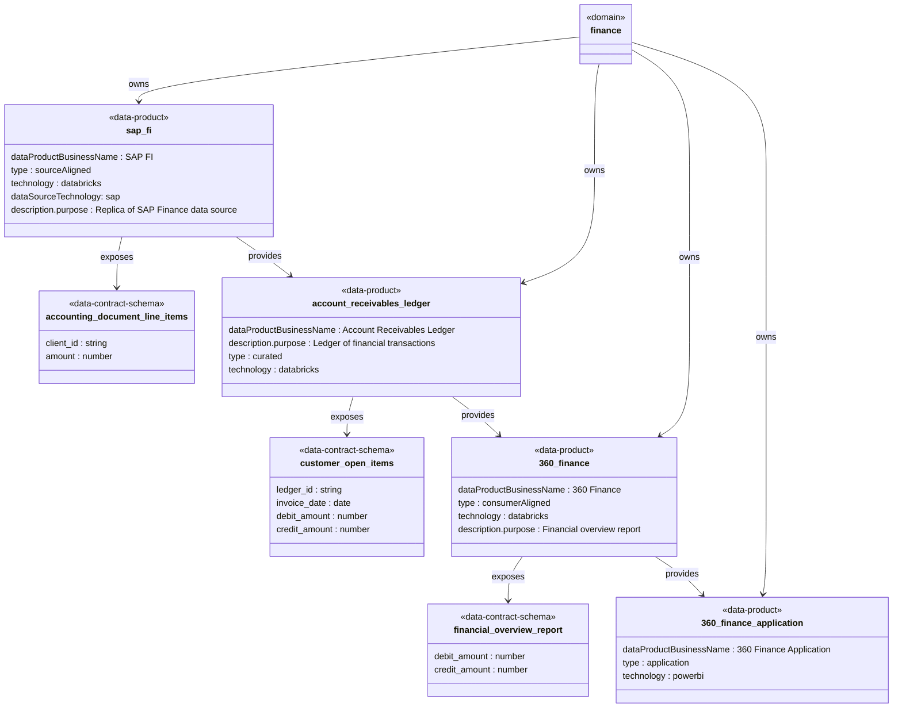

```mermaid
classDiagram
    %% DOMAIN
    class finance{
        <<domain>>
    }
    finance --> sap_fi: owns
    finance --> account_receivables_ledger : owns
    finance --> 360_finance: owns
    finance --> 360_finance_application: owns
    %% SOURCE ALIGNED DATA PRODUCT
    sap_fi --> accounting_document_line_items : exposes
    class sap_fi{
        <<data-product>>
        dataProductBusinessName : SAP FI
        type : sourceAligned
        technology : databricks
        dataSourceTechnology: sap
        description.purpose : Replica of SAP Finance data source
    }
    class accounting_document_line_items{
        <<data-contract-schema>>
        client_id : string
        amount : number
    }
    %% CURATED DATA PRODUCT
    account_receivables_ledger --> customer_open_items : exposes
    class account_receivables_ledger{
        <<data-product>>
        dataProductBusinessName : Account Receivables Ledger
        description.purpose : Ledger of financial transactions
        type : curated
        technology : databricks
    }
    class customer_open_items {
        <<data-contract-schema>>
        ledger_id : string
        invoice_date : date
        debit_amount : number
        credit_amount : number
    }
    %% CONSUMER ALIGNED DATA PRODUCT
    360_finance --> financial_overview_report : exposes
    class 360_finance{
        <<data-product>>
        dataProductBusinessName : 360 Finance
        type : consumerAligned
        technology : databricks
        description.purpose : Financial overview report
    }
    class financial_overview_report{
        <<data-contract-schema>>
        debit_amount : number
        credit_amount : number
    }
    %% APPLICATION DATA PRODUCT
    class 360_finance_application {
        <<data-product>>
        dataProductBusinessName : 360 Finance Application
        type : application
        technology : powerbi
    }
    sap_fi --> account_receivables_ledger : provides
    account_receivables_ledger --> 360_finance: provides
    360_finance --> 360_finance_application : provides
```
