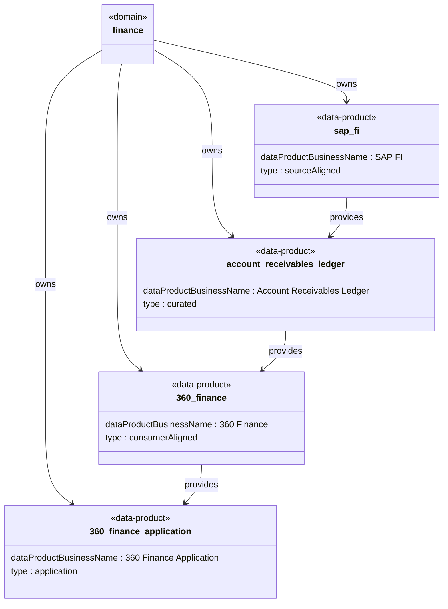

```mermaid
classDiagram
    %% DOMAIN
    class finance{
        <<domain>>
    }
    finance --> sap_fi: owns
    finance --> account_receivables_ledger : owns
    finance --> 360_finance: owns
    finance --> 360_finance_application: owns
    %% SOURCE ALIGNED DATA PRODUCT
    class sap_fi{
        <<data-product>>
        dataProductBusinessName : SAP FI
        type : sourceAligned
    }
    %% CURATED DATA PRODUCT
    class account_receivables_ledger{
        <<data-product>>
        dataProductBusinessName : Account Receivables Ledger
        type : curated
    }
    %% CONSUMER ALIGNED DATA PRODUCT
    class 360_finance{
        <<data-product>>
        dataProductBusinessName : 360 Finance
        type : consumerAligned
    }
    %% APPLICATION DATA PRODUCT
    class 360_finance_application {
        <<data-product>>
        dataProductBusinessName : 360 Finance Application
        type : application
    }
    sap_fi --> account_receivables_ledger : provides
    account_receivables_ledger --> 360_finance: provides
    360_finance --> 360_finance_application : provides
```
